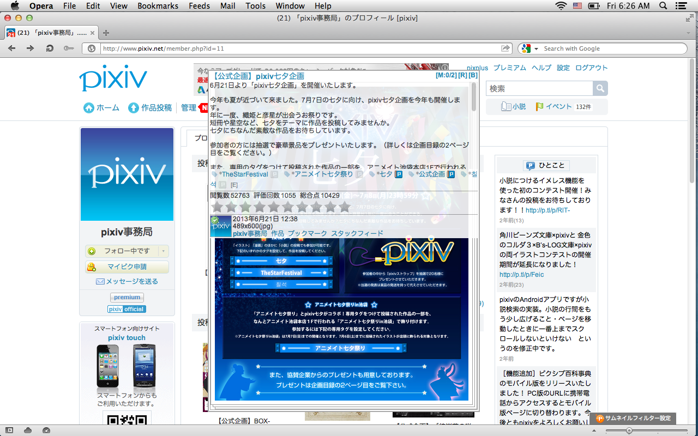

pixplus
=======

Browser extension for pixiv.

Donate! => http://www.pixiv.net/premium.php

## Screenshot



## Supported browsers

* GoogleChrome/Chromium (crx/Greasemonkey)
* Firefox / ESR (Greasemonkey/Scriptish)
* Safari (safariextz)
* Opera 15+ (crx)
* Opera 12 (oex/UserJS)

## License

The MIT License

## Version history

[changelog.md](changelog.md)

## Build requirements

* make (GNU Make)
* rsvg-convert or inkscape
* python 2.7+ or 3.3+
* zip (oex)
* ruby (crx)
* rubyzip 1.0.0+ (crx)
* openssl (crx/safariextz)

## How to build

```bash
$ git submodule update --init
$ make deps
$ make
```

You can skip `make deps` if you don't want to build safariextz.

You can skip `git submodule update --init` and `make deps`
if you don't want to build crx and safariextz.

## How to sign safariextz

1.  Get signing certificates from [Safari Dev Center].
1.  Make an empty extension, **foo.safariextz**.
1.  Export secret key from **Keychain Access.app** as pkcs12 format.
1.  Extract certificates from **foo.safariextz** and put into **safari/sign/??.crt**. (??: 00~02)
1.  Convert exported pkcs12 file to PEM format and put into **safari/sign/key.pem**.
1.  `make clean; make`

You can shortcut step4~5 by following:

```bash
$ safari/prepare_sign.sh foo.safariextz Certificates.p12
```

[Safari Dev Center]: https://developer.apple.com/devcenter/safari/
